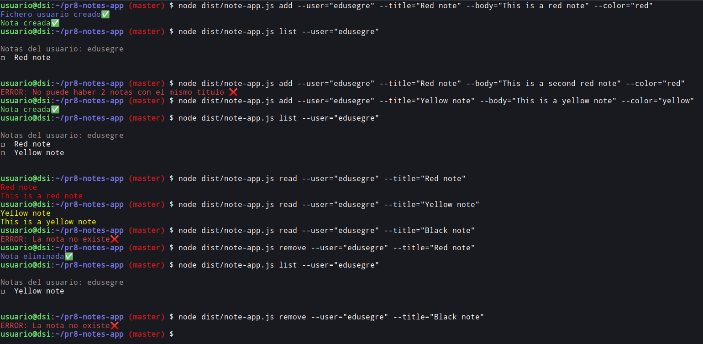

# Práctica 8: Aplicación de procesamiento de notas de texto


<p align="center">
    <a href="https://github.com/ULL-ESIT-INF-DSI-2021/ull-esit-inf-dsi-20-21-prct08-filesystem-notes-app-alu0101123677/actions/workflows/tests.yml">
        
    </a>
    <a href='https://coveralls.io/github/ULL-ESIT-INF-DSI-2021/ull-esit-inf-dsi-20-21-prct08-filesystem-notes-app-alu0100785630?branch=master'>
        
    </a>
    <a href='https://sonarcloud.io/dashboard?id=ULL-ESIT-INF-DSI-2021_ull-esit-inf-dsi-20-21-prct08-filesystem-notes-app-alu0100785630'>
        
    </a>
</p>


## Introducción

Este es el informe de la octava práctica, donde he implementado una aplicación de procesamiento de notas. He podido familiarizarme con las API de Node.js y la utilización del sistema de ficheros mediante TypeScript.

Como se recomienda en el guión, he intentado seguir las técinas de desarrollo que hemos aprendido hasta el momento, generar documentaicón, basar el código en pruebas, asegurarnos que el código está "cubierto", seguir principios SOLID de Programación Orientada a Objetos y un largo etc. 


## Configuración del entorno de trabajo

Para configurar el entorno de trabjo y optimizar el tiempo  (_"not to reinvent the wheel"_ como se diría en inglés), he aprovechado el repositorio que ha facilitado el profesor Eduardo:

- [Enlace al repositorio GitHub Action para comprobar la calidad y seguridad del código fuente mediante Sonar Cloud](https://github.com/ULL-ESIT-INF-DSI-2021/github-actions-sonar-cloud)

He descargado el contenido del repositorio en mi máquina local y luego los he transferido todos los ficheros usando el comando `scp` al directorio de que he creado para la práctica en el servidor del IaaS:

```bash
usuario@dsi:~$ mkdir pr8-notes-app
```

```bash
alberto@xps-13:Downloads/github-actions-sonar-cloud-main $ scp -Cpr ./* dsi:/home/usuario/pr5-objects-classes-interfaces
```

Una vez hecho esto, ya tengo todo el set up con las dependencias necesarias y la estructura de ficheros. Todo lo que queda por hacer es:

```bash
npm install
```


He cambiado los ficheros `coveralls.yml`, `tests.yml`y `sonar-cloud.yml` para que escuche en la rama `master` en vez de `main`. Asimismo, he actualizado el fichero `sonar-project-properties` para que contenga la información de mi repositorio.

Una vez configurado la estructura de ficheros-directorios y las herramientas necesarias, he procedido a instalar las dependencias necesarias para la realización de la práctica:

- API síncrona de Node.JS para trabajar con ficheros:
```bash
npm install --save-dev @types/node
```

- Chalk para dar color a la consola:
```bash
npm install --save-dev chalk
```

- Yargs para la utilización de argumentos:
```bash
npm install --save-dev yargs @types/yargs
```

## Práctica

He creado una __clase Note__ que constituye el conjunto de datos que tiene una nota:

- Título
- Contenido o cuerpo
- Color

He escrito diferentes getters y setters para configurar los atributos recién mencionados, además de un método `toJSON` que devuelve la nota en formato JSON.


```typescript
export class Note {

  constructor (
    public title: string, 
    public content: string, 
    public color: string) {
      this.title = title;
      this.content = content;
      this.color = color;
  }

  getTitle() {
    return this.title;
  }

  setTitle(title: string): void {
    this.title = title;
  }

  getColor() {
    return this.color;
  }

  setColor(color: string): void {
    this.color = color;
  }

  getContent() {
    return this.content;
  }

  setContent(content: string): void {
    this.content = content;
  }

  toJSON(): string {
    return '{\n\"titulo\": \"' + this.title + '\",\n\"cuerpo\": \"' + this.content + '\",\n\"color\": \"' + this.color + '\"\n}';
  }
}
```


### Ejecución de la aplicación

Aquí muestro un ejemplo de cómo se ejecuta la aplicación:




## Conclusión

## Bibliografía