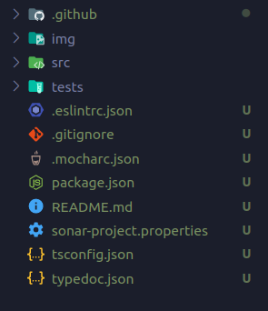

# Práctica 8: Aplicación de procesamiento de notas de texto


<p align="center">
    <a href="https://github.com/ULL-ESIT-INF-DSI-2021/ull-esit-inf-dsi-20-21-prct08-filesystem-notes-app-alu0101123677/actions/workflows/tests.yml">
        
    </a>
    <a href='https://coveralls.io/github/ULL-ESIT-INF-DSI-2021/ull-esit-inf-dsi-20-21-prct08-filesystem-notes-app-alu0100785630?branch=master'>
        
    </a>
    <a href='https://sonarcloud.io/dashboard?id=ULL-ESIT-INF-DSI-2021_ull-esit-inf-dsi-20-21-prct08-filesystem-notes-app-alu0100785630'>
        
    </a>
</p>


## Introducción

Este es el informe de la octava práctica, donde he implementado una aplicación de procesamiento de notas. He podido familiarizarme con las API de Node.js y la utilización del sistema de ficheros mediante TypeScript.

Como se recomienda en el guión, he intentado seguir las técinas de desarrollo que hemos aprendido hasta el momento, generar documentaicón, basar el código en pruebas, asegurarnos que el código está "cubierto", seguir principios SOLID de Programación Orientada a Objetos y un largo etc. 


## Configuración del entorno de trabajo

Para configurar el entorno de trabjo y optimizar el tiempo  (_"not to reinvent the wheel"_ como se diría en inglés), he aprovechado el repositorio que ha facilitado el profesor Eduardo:

- [Enlace al repositorio GitHub Action para comprobar la calidad y seguridad del código fuente mediante Sonar Cloud](https://github.com/ULL-ESIT-INF-DSI-2021/github-actions-sonar-cloud)

He descargado el contenido del repositorio en mi máquina local y luego los he transferido todos los ficheros usando el comando `scp` al directorio de que he creado para la práctica en el servidor del IaaS:

```bash
usuario@dsi:~$ mkdir pr8-notes-app
```

```bash
alberto@xps-13:Downloads/github-actions-sonar-cloud-main $ scp -Cpr ./* dsi:/home/usuario/pr5-objects-classes-interfaces
```

Una vez hecho esto, ya tengo todo el set up con las dependencias necesarias y la estructura de ficheros. Todo lo que queda por hacer es:

```bash
npm install
```


He cambiado los ficheros `coveralls.yml`, `tests.yml`y `sonar-cloud.yml` para que escuche en la rama `master` en vez de `main`. Asimismo, he actualizado el fichero `sonar-project-properties` para que contenga la información de mi repositorio.

Una vez configurado la estructura de ficheros-directorios y las herramientas necesarias, he procedido a instalar las dependencias necesarias para la realización de la práctica:

- API síncrona de Node.JS para trabajar con ficheros:
```bash
npm install --save-dev @types/node
```

- Chalk para dar color a la consola:
```bash
npm install --save-dev chalk
```

- Yargs para la utilización de argumentos:
```bash
npm install --save-dev yargs @types/yargs
```

## Práctica

He creado una __clase Note__ que constituye el conjunto de datos que tiene una nota:

- Título
- Contenido o cuerpo
- Color

He escrito diferentes getters y setters para configurar los atributos recién mencionados, además de un método `toJSON` que devuelve la nota en formato JSON.


```typescript
export class Note {

  constructor (
    public title: string, 
    public content: string, 
    public color: string) {
      this.title = title;
      this.content = content;
      this.color = color;
  }

  getTitle() {
    return this.title;
  }

  setTitle(title: string): void {
    this.title = title;
  }

  getColor() {
    return this.color;
  }

  setColor(color: string): void {
    this.color = color;
  }

  getContent() {
    return this.content;
  }

  setContent(content: string): void {
    this.content = content;
  }

  toJSON(): string {
    return '{\n\"titulo\": \"' + this.title + '\",\n\"cuerpo\": \"' + this.content + '\",\n\"color\": \"' + this.color + '\"\n}';
  }
}
```


Seguidamnete, para la interacción del usuario con la aplicación, he creado una clas `commandFunctions` que engloba las funciones de lectura-escritura en ficheros usando el módulo FileSystem del core de Node. He seguido cuidadosamente la __documentación__ e implemtado las funciones que requería la práctica.


```typescript
import * as fs from 'fs';
import * as chalk from 'chalk';
import { Note } from './note';


export class commandFunctions {
  constructor() {}

  addNote(
    user: string, 
    title: string, 
    content: string,
    color: string): void {

    if (!fs.existsSync(`notes/${user}`)) {
      fs.mkdirSync(`notes/${user}`, { recursive: true });
      console.log(chalk.blue('Fichero usuario creado✅'));
    }

    const nota = new Note(title, content, color);

    if (!fs.existsSync(`notes/${user}/${title}.json`)) {
      fs.writeFileSync(`notes/${user}/${title}.json`, nota.toJSON());
      console.log(chalk.green('Nota creada✅'));
    } 
    else
      console.log(chalk.red('ERROR: No puede haber 2 notas con el mismo título ❌'));
  }

  deleteNote(
    user: string, 
    title: string): void {

    if (fs.existsSync(`notes/${user}/${title}.json`)) {
      fs.rmSync(`notes/${user}/${title}.json`);
      console.log(chalk.blue('Nota eliminada✅'));
    } 
    else
      console.log(chalk.red('ERROR: La nota no existe❌'));
  }

  editNote(
    user: string, 
    title: string, 
    content: string,
    color: string): void {

    if (fs.existsSync(`notes/${user}/${title}.json`)) {
      const nota = new Note(title, content, color);
      fs.writeFileSync(`notes/${user}/${title}.json`, nota.toJSON());
      console.log(chalk.green('Nota editada✅'));
    } 
    else
      console.log(chalk.red('ERROR: La nota no existe❌'));
  }

  showNotes( user: string ): Note[] {
    let notes: Note[] = [];
    
    fs.readdirSync(`notes/${user}`).forEach((n) => {

      let data = fs.readFileSync(`notes/${user}/${n}`),
      noteJsonData = JSON.parse(data.toString()),
      note = new Note(noteJsonData.title, noteJsonData.content, noteJsonData.color);

      notes.push(note);
    });

    return notes;
  }

  readNote(
    user: string, 
    title: string): void {

    if (fs.existsSync(`notes/${user}/${title}.json`)) {

      let data = fs.readFileSync(`notes/${user}/${title}.json`),
      noteJsonData = JSON.parse(data.toString()),
      note = new Note(noteJsonData.title, noteJsonData.content, noteJsonData.color);

      console.log(chalk.keyword(note.getColor())(note.getTitle()));
      console.log(chalk.keyword(note.getColor())(note.getContent()));
    }
    else
      console.log(chalk.red('ERROR: La nota no existe❌'));
  }
}
```

Posteriormente, en un fichero aparte, he creado los argumentos en línea de comandos necesarios usando `yargs`. Una vez están correctamente definidos, simplemente llamo a las funciones de `commandFunctions` adecuadas:

```typescript
import * as chalk from 'chalk';
import * as yargs from 'yargs';
import { commandFunctions } from './commandFunctions';
import { Note } from './note';

const noteFunctions = new commandFunctions();

let errorMessage = () => {
  console.log(chalk.red('ERROR: Invalid arguments❌'));
}

yargs.command({
  command: 'add',
  describe: 'Añadir una nota',
  builder: {
    user: {
      describe: 'Nombre de usuario',
      demandOption: true,
      type: 'string',
    },
    title: {
      describe: 'Título de la nota',
      demandOption: true,
      type: 'string',
    },
    body: {
      describe: 'Contenido de la nota',
      demandOption: true,
      type: 'string',
    },
    color: {
      describe: 'Color de la nota',
      demandOption: true,
      type: 'string',
    },
  },

  handler(argv) {
    if (typeof argv.user === 'string' && 
        typeof argv.title === 'string' &&
        typeof argv.body === 'string' && 
        typeof argv.color === 'string') 
      noteFunctions.addNote(argv.user, argv.title, argv.body, argv.color);
    
    else
      errorMessage();
  },
});


yargs.command({
  command: 'remove',
  describe: 'Elimina una nota',
  builder: {
    user: {
      describe: 'Nombre de usuario',
      demandOption: true,
      type: 'string',
    },
    title: {
      describe: 'Título de la nota',
      demandOption: true,
      type: 'string',
    },
  },
  
  handler(argv) {
    if (typeof argv.user === 'string' && typeof argv.title === 'string') 
      noteFunctions.deleteNote(argv.user, argv.title);
  
    else
      errorMessage();
  },
});


yargs.command({
  command: 'modify',
  describe: 'Editar una nota',
  builder: {
    user: {
      describe: 'Nombre de usuario',
      demandOption: true,
      type: 'string',
    },
    title: {
      describe: 'Título de la nota',
      demandOption: true,
      type: 'string',
    },
    body: {
      describe: 'Contenido de la nota',
      demandOption: true,
      type: 'string',
    },
    color: {
      describe: 'Color de la nota',
      demandOption: true,
      type: 'string',
    },
  },

  handler(argv) {
    if (typeof argv.user === 'string' && 
        typeof argv.title === 'string' &&
        typeof argv.body === 'string' && 
        typeof argv.color === 'string')
      noteFunctions.editNote(argv.user, argv.title, argv.body, argv.color);

    else
      errorMessage();
  },
});


yargs.command({
  command: 'read',
  describe: 'Leer una nota',
  builder: {
    user: {
      describe: 'Nombre de usuario',
      demandOption: true,
      type: 'string',
    },
    title: {
      describe: 'Título de la nota',
      demandOption: true,
      type: 'string',
    },
  },

  handler(argv) {
    if (typeof argv.user === 'string' && typeof argv.title === 'string')
      noteFunctions.readNote(argv.user, argv.title);
    else
      errorMessage();
  },
});


yargs.command({
  command: 'list',
  describe: 'Mostrar todas las notas del usuario',
  builder: {
    user: {
      describe: 'Nombre de usuario',
      demandOption: true,
      type: 'string',
    },
  },

  handler(argv) {
    if (typeof argv.user === 'string') {
      let notes: Note[] = noteFunctions.showNotes(argv.user);

      console.log(chalk.white('\nNotas del usuario: ' + argv.user));

      notes.forEach((n) => {
        console.log('▫ ', n.title);
      });

      console.log('\n');
    } 

    else 
      errorMessage();
    
  },
});

yargs.parse();
```


### Ejecución de la aplicación

Aquí muestro un ejemplo de cómo se ejecuta la aplicación:


## Conclusión

Ha sido un ejericio muy interesante y entretenido. Siempre es satisfactorio familiarizarse con nuevas dependencias y técnicas que aseguran que nuestro código es seguro y profesional.

## Bibliografía

- Recursos del aula virtuañ
- [TypeDoc](https://typedoc.org/)
- [Mocha](https://mochajs.org/)
- [Chai](https://www.chaijs.com/)
- [Guión de la Práctica](https://ull-esit-inf-dsi-2021.github.io/prct08-filesystem-notes-app/)
- [Repositorio Coveralls y Sonar Cloud](https://campusingenieriaytecnologia.ull.es/mod/url/view.php?id=289851)
- [Vídeo de configuración de Sonar Cloud](https://drive.google.com/file/d/1FLPargdPBX6JaJ_85jNsRzxe34sMi-Z3/view)
- [Yargs](https://www.npmjs.com/package/yargs)
- [Chalk](https://www.npmjs.com/package/chalk)
- [FileSystem Node](https://nodejs.org/dist/latest-v15.x/docs/api/fs.html#fs_synchronous_api)